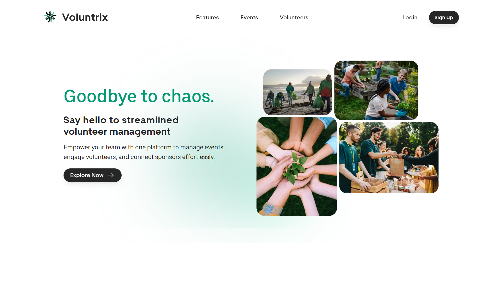

# Voluntrix Frontend 
**Next.js 15 React App for Volunteer Management Platform Interface**  

  
  

#### Explore the app here: [voluntrix-devsprint.vercel.app](https://voluntrix-devsprint.vercel.app/)



## Table of Contents
- [Project Overview](#project-overview)
- [Tech Stack](#tech-stack)
- [Setup & Installation](#setup--installation)
<!-- - [Database Configuration](#database-configuration)
- [API Endpoints](#api-endpoints)
- [Running the Project](#running-the-project)
- [Deployment](#deployment)
- [Contributing](#contributing)
- [License](#license) -->

---

## Project Overview
This backend serves as the core for **Voluntrix**, a volunteer management system that allows:  
- **Organizations** to create events  
- **Volunteers** to join and track progress  
- **Sponsors** to support events  

Features include:  
 -  **User Authentication (JWT Security)**  
 -  **Event & Task Management**  
 -  **Volunteer Tracking & Rankings**  
 -  **Sponsor & Donation Management**  

---

## Tech Stack
- **TypeScript 5** – Frontend Language
- **React 19** – Frontend library 
- **Next.js 15.1.6** – Framework
- **Tailwind CSS 3.4.1** – CSS framework 
- **HeroUI** – Tailwind-based UI component library
- **Axios** – HTTP client used for making API requests
- **WebSockets (SockJS & STOMP)** – Real-time client-server communication
- **Framer Motion & GSAP** – Libraries for smooth animations

---

## Setup & Installation

1. Clone the Repository
```bash
https://github.com/DevSprint-FIT/voluntrix-frontend.git
cd voluntrix-frontend
```

2. Install Dependencies
```bash
npm install
```

3. Start Development Server
```bash
npm run dev
```
